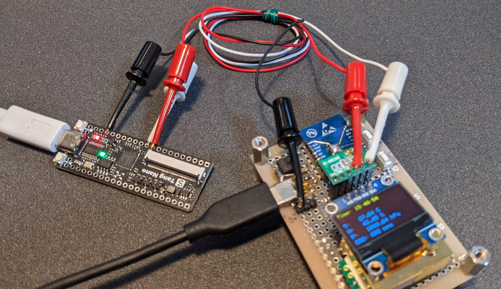
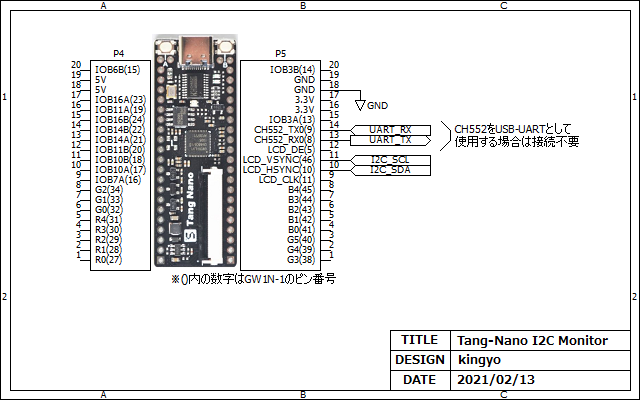

# Tang-Nano_I2C_Monitor
I2C Bus monitor on Tang-Nano FPGA !!  
  

## Usage
1. Update the CH552T firmware to enable UART communication.  (See here : [Tang NanoのFPGAとPC間でUART通信をする](https://qiita.com/ciniml/items/05ac7fd2515ceed3f88d))
2. Write [BitStream](impl/pnr/i2c_moni.fs) file to FPGA.
3. Connect the Tang-Nano 'I2C_SCL' and 'I2C_SDA' pin to I2C Bus line.
4. Connect to a PC and open the serial terminal. Baud rate is 1Mbps.

## Output Example

```
S 78 A 00 A AE A D5 A 80 A A8 A P
S 78 A 00 A 3F A P
S 78 A 00 A D3 A 00 A 40 A 8D A P
S 78 A 00 A 14 A P
S 78 A 00 A 20 A 00 A A1 A C8 A P
S 78 A 00 A DA A 12 A 81 A P
S 78 A 00 A CF A P
S 78 A 00 A D9 A P
S 78 A 00 A F1 A P
S 78 A 00 A DB A 40 A A4 A A6 A 2E A AF A P
S 78 A 00 A 22 A 00 A FF A 21 A 00 A P
S 78 A 00 A 7F A P
```

|  Symbol  |  Description |
| -------- | ------ |
| S | Start condition |
| P | Stop condition 
| A | ACK |
| N | NACK |

|  LED  |  Description |
| -------- | ------ |
| Red | UART Tx FIFO Overflow (Press button A to reset) |
| Green | UART Tx busy | 
| Blue | Not use |

## Schematic
  

## IDE
- GOWIN FPGA Designer Version 1.9.7.02 Beta build(44900)

## Resource Usage Summary
|  Resource  |  Usage |  Utilization  |
| ---------- | ------ | ------------- |
|  Logics  |  195/1152  | 16% |
|  --LUTs,ALUs,ROM16s  |  195(170 LUT, 25 ALU, 0 ROM16)  | - |
|  --SSRAMs(RAM16s)  |  0  | - |
|  Registers  |  101/945  | 10% |
|  --logic Registers  |  99/864  | 11% |
|  --I/O Registers  |  2/81  | 2% |
|  BSRAMs  |  4 SDPB | 100% |
